# cursor-skill-delegated-processes

A [Cursor Agent Skill](https://docs.cursor.com/) that facilitates a recurring team meeting using a **local-first capture, deliberate publish** model — Confluence is the first publish target, but the runtime store is a local scratchpad — combining three complementary practices:

- **Roles (who does what):** **Alain Cardon's Systemic Team Coaching Delegated Processes** — rotating systemic roles. Applies to every session.
- **Behavior (how each person shows up):** **Jim and Michele McCarthy's Core Protocols** — shared in-meeting protocols any attendee can invoke. Applies to every session.
- **Retrospective agenda (when applicable):** **Esther Derby and Diana Larsen's *Agile Retrospectives*** — the 5-stage agenda (Set the Stage, Gather Data, Generate Insights, Decide What to Do, Close the Retrospective). Applies only when the session is a retrospective.
- **Decision-shaping (when invoked):** **Silent round** — a structured silent-generate → simultaneous-reveal → cluster-or-discuss → optional-re-think protocol the Decision Driver can invoke for judgment-heavy decisions where the room has a HiPPO or expertise asymmetry. Lineage: Nominal Group Technique (Delbecq, Van de Ven & Gustafson, 1971/1975) · KJ method (Kawakita, 1960s) · silent brainwriting (Rohrbach, 1968). Public-domain methodology. Applies only when the Decision Driver invokes it.

The skill runs in two phases:

1. **Prepare (Confluence-aware interview).** Connects to the Atlassian / Confluence MCP, finds prior sessions in a chosen space by tag and similar title, reads the team's roster page to resolve attendees to real `@mentions`, proposes a fair role rotation (Cardon's circulation principle), and points each role-holder at the Core Protocols they can lean on.
2. **Capture-then-publish.** Opens a local session scratchpad at `~/.cursor/skills/delegated-processes/sessions/{YYYYMMDDHHMM}-{slug}/` (with `session.json` + `preview.md`). Decisions, process notes, pacer log, and check-in entries go to the scratchpad **as they happen** during the meeting — Confluence is not touched. At end-of-meeting the skill offers to publish; on confirmation it creates a single new Confluence page tagged with the skill marker, populated end-to-end from the scratchpad.

The local scratchpad is the durable record. Published destinations are derived views of it. The MVP destination is Confluence; the design leaves room for additional adapters (Notion, Slack canvas, GitHub issue, etc.) without changing the capture format.

## Sources and attribution

### Structure / roles — Alain Cardon

> **Systemic Team Coaching Delegated Processes** — A Systemic Team Coaching and Organization Coaching Tool
> Alain Cardon, MCC — Metasystème Coaching
> <https://www.metasysteme-coaching.eu/english/systemic-team-coaching-delegated-processes/>

### Behavioral layer — Jim and Michele McCarthy

> **The Core Protocols** — *Software For Your Head*
> Jim and Michele McCarthy
> License: **GPL v3+** — <https://www.gnu.org/licenses/>
> Source (full text and protocol mechanics): <https://liveingreatness.com/core-protocols/>

The skill **references** the Core Protocols by name and links to the source URL — it does not reproduce protocol text or mechanics, and does not redistribute the McCarthy source document. That is what keeps this skill MIT-licensed (reference, not derivation) while remaining fully GPL-compliant. The integration map (which protocol plugs into which Cardon moment) lives in [`core-protocols.md`](core-protocols.md).

### Retrospective outer agenda — Esther Derby and Diana Larsen (retros only)

> **Agile Retrospectives: Making Good Teams Great**
> Esther Derby and Diana Larsen
> Pragmatic Bookshelf, 2006
> Publisher: <https://pragprog.com/titles/dlret/agile-retrospectives/>
> Author sites: <https://www.estherderby.com/> · <https://www.dianalarsen.com/>

When the session is identified as a retrospective, the skill structures the agenda around the 5 stages from the book. The skill **references** the 5 stages by name and provides original operational guidance about how each stage maps to Cardon roles and Core Protocols — the book's specific activities (Mad Sad Glad, Timeline, 5 Whys, etc.) are **not** reproduced. Read the book or use a community catalog like <https://retromat.org/> for activity ideas. The integration lives in [`retrospective-stages.md`](retrospective-stages.md).

Derby & Larsen are cited only when retro mode is active for a session. The Cardon and McCarthy attributions remain on every session.

### Decision-shaping protocol — Silent round (when invoked)

> **Nominal Group Technique (NGT)**
> André L. Delbecq, Andrew H. Van de Ven & David H. Gustafson — *Group Techniques for Program Planning: A Guide to Nominal Group and Delphi Processes*, Scott Foresman, 1975.
>
> **KJ method / affinity diagram** — Jiro Kawakita, 1960s.
>
> **Silent brainwriting** — Bernd Rohrbach, *Kreativ nach Regeln*, 1968.

When the Decision Driver invokes a **Silent round** during the meeting — to shape a judgment-heavy decision before commitment — the skill references this public-domain lineage by name and links to it; the source texts are not reproduced. Operational guidance (phases, role + protocol map, Path A vs Path B, hard rules, anti-patterns) lives in [`silent-round.md`](silent-round.md).

The Silent round is **not** a McCarthy Core Protocol. It is a Cardon-layer composition that uses several Core Protocols as primitives (Intention Check, Pass / Unpass, Ask For Help, Protocol Check, Decider, Resolution). The licensing layers stay separate: McCarthy protocols remain GPL-clean (reference + link only); the Silent round adds a fourth, public-domain layer that the Decision Driver opts into per question.

This lineage is cited only on sessions where at least one Silent round was actually invoked. Sessions that don't use it don't carry the citation.

#### Flow at a glance

Visual companion to the protocol — operational detail lives in [`silent-round.md`](silent-round.md). Phases marked `silent` are private writing; `reveal` is the Facilitator-cued simultaneous post; `discuss` covers both Path A clustering and Path B open discussion; `handoff` is the data-gathering exit; `escalate` is the loop-2-failed-to-converge exit.

```mermaid
flowchart TD
    A["Phase 0 — Frame prompt + output shape<br/>'best vacation destination?' / 'what surprised you?' /<br/>'top 3 root causes' / 'candidate actions'<br/><br/><b>Decision Driver</b> owns framing<br/>Core Protocol: <b>Intention Check</b> if muddy"] --> B
    B["Phase 1 — Silent generation<br/>~2-5 min, each person writes individually<br/>paper · sticky notes · private chat draft · whiteboard private mode<br/>output may be 1 item or many<br/><br/><b>Pacer</b> holds the timebox<br/>'?' sticky legal for clarifying Qs"] --> C
    C["Phase 2 — Simultaneous reveal<br/>everyone posts / flips / submits AT THE CUE<br/><br/><b>Facilitator</b> cues 'reveal'<br/>Core Protocol: <b>Protocol Check</b> if anyone reveals early"]
    C --> D{Items self-explanatory?}
    D -- "Yes (e.g. destination names)" --> E
    D -- "No (e.g. behavioural observations)" --> X
    X["Phase 2.5 — Optional author-explains pass<br/>each author has ~30s to say WHY their item is on the board<br/>one-shot per author, NOT round-robin one-at-a-time<br/><br/><b>Facilitator</b> runs<br/>Core Protocol: <b>Pass / Unpass</b> applies here"] --> E
    E{Output shape?}
    E -- "Generative / divergent<br/>(ideas, surprises, concerns)" --> F1
    E -- "Convergent / decision-bearing<br/>(actions, picks, options)" --> F2
    F1["Phase 3a — Cluster (affinity / KJ)<br/>group stickies into themes on the whiteboard<br/>~5-10 min<br/><br/><b>Facilitator</b> runs<br/>Core Protocols: <b>Ask For Help</b>, <b>Intention Check</b>"]
    F2["Phase 3b — Open discussion<br/>balanced airtime on the full board<br/>~5-10 min<br/><br/><b>Facilitator</b> runs<br/>Core Protocols: <b>Ask For Help</b>, <b>Intention Check</b>, <b>Protocol Check</b>"]
    F1 --> G{Need a second<br/>silent pass?}
    F2 --> G
    G -- "No: themes / candidate clear<br/>OR purpose was data-gathering" --> H
    G -- "Yes (loop 1 → loop 2 only)<br/>still divergent OR need private rank" --> I
    I["Phase 4 — Silent re-think / re-rank<br/>~2-3 min, same private medium<br/>refine own stickies · rank top N privately ·<br/>write a single converged proposal<br/><br/><b>Pacer</b> holds the timebox"] --> J
    J["Phase 5 — Simultaneous reveal #2<br/><br/><b>Facilitator</b> cues 'reveal'"] --> K{Aligned?}
    K -- "Yes" --> H
    K -- "No, loop 2 done" --> L
    H{Exit?}
    H -- "Decision-bearing" --> M["Phase 6a — Frame proposal<br/>text + pilot + dated deadline + success measure<br/><br/><b>Decision Driver</b> owns"]
    H -- "Data-gathering<br/>(retro Stage 2 / insight feed)" --> N["Phase 6c — Handoff<br/>output passes to next agenda step or retro stage<br/>no Decider; no abort<br/><br/><b>Decision Driver</b> records the handoff"]
    L["Phase 6b — Most-supported + flag dissent<br/>'team did not converge — adopting X, Y dissents on Z'<br/><br/><b>Decision Driver</b> owns<br/><b>Process Coach</b> notes non-convergence"]
    M --> O
    L --> O
    O["Phase 7 — Decider<br/>standard McCarthy protocol"]
    O --> P{No vote?}
    P -- Yes --> Q["Resolution"]
    P -- No --> R
    Q --> R
    N --> R
    R["Phase 8 — Capture in scratchpad<br/>captures.silentLog + maybe captures.decisions<br/>preview.md regenerated<br/><br/><b>Process Coach</b> observes for Stage 5 / final 10 min<br/>feed-forward via <b>Perfection Game</b>"]

    classDef silent fill:#eef,stroke:#33c,color:#000
    classDef reveal fill:#efe,stroke:#080,color:#000
    classDef discuss fill:#ffd,stroke:#aa0,color:#000
    classDef decision fill:#fed,stroke:#c80,color:#000
    classDef escalate fill:#fee,stroke:#c33,color:#000
    classDef handoff fill:#ded,stroke:#393,color:#000
    class B,I silent
    class C,J reveal
    class X,F1,F2 discuss
    class D,E,G,K,H,P decision
    class L escalate
    class N handoff
```



### What every session opens with

Every session — both in chat and on the created Confluence page — opens with this attribution block verbatim:

```
Format (structure): Systemic Team Coaching Delegated Processes — by Alain Cardon, MCC.
Source: https://www.metasysteme-coaching.eu/english/systemic-team-coaching-delegated-processes/

Behavioral layer: The Core Protocols — by Jim and Michele McCarthy. License: GPL v3+.
Source: https://liveingreatness.com/core-protocols/

Skill: cursor-skill-delegated-process
```

The last line is also the **CQL search anchor** that lets the next session find this page in Confluence. Read both source URLs for the practices in depth — the skill captures only enough to operate the rotation, briefings, decisions, and process notes.

When **retro mode** is active, an additional Derby & Larsen block is inserted between the Core Protocols and `Skill:` lines. When at least one **Silent round** is invoked during the session, a Silent round lineage block (NGT · KJ method · silent brainwriting) is appended retroactively on first invocation. Both blocks are omitted from sessions that do not use those layers.

## What's in this repo

```
.
├── README.md                  # this file
├── SKILL.md                   # the skill (the agent reads this)
├── roles.md                   # per-role briefing reference, with Core Protocols call-outs
├── core-protocols.md          # integration map: which Core Protocol plugs into which Cardon moment
├── retrospective-stages.md    # retro mode: Derby & Larsen 5-stage agenda + role/protocol mapping
├── silent-round.md            # decision-shaping protocol the Decision Driver can invoke (NGT / KJ lineage)
└── confluence-page.html       # canonical page structure (HTML for createConfluencePage)
```

## Prerequisites

An Atlassian / Confluence MCP server must be configured in Cursor with at least these tools:

- `getAccessibleAtlassianResources`
- `getConfluenceSpaces`
- `getConfluencePage`
- `searchConfluenceUsingCql`
- `createConfluencePage`
- `updateConfluencePage`

If any of these is missing, the skill refuses to start rather than fall back to local files. The whole point of the redesign is that Confluence is the durable store — no half-measures.

## Install

Copy or symlink this folder into one of:

- `~/.cursor/skills/delegated-processes/` — personal, available across all your projects.
- `<your-repo>/.cursor/skills/delegated-processes/` — project-scoped, shared with your team.

> Do **not** put it under `~/.cursor/skills-cursor/` — that path is reserved for Cursor's built-in skills.

### macOS / Linux

```bash
git clone https://github.com/JulienAmiot/cursor-skill-delegated-processes.git \
  ~/.cursor/skills/delegated-processes
```

### Windows (PowerShell)

```powershell
git clone https://github.com/JulienAmiot/cursor-skill-delegated-processes.git `
  "$HOME\.cursor\skills\delegated-processes"
```

Restart Cursor (or reload the skills index) and the agent will discover it.

## Use it

In a Cursor chat, ask things like:

- "Run a delegated-processes session for our weekly exec meeting."
- "Prepare the Sprint 17 retro for the Campaign team in Confluence."
- "Update yesterday's retro page with these decisions: …"

The skill follows a strict one-question-at-a-time interview:

1. Opens with the 3-line attribution.
2. Discovers the Atlassian cloudId, asks which space.
3. Asks the parent location — accepts both pages **and folders** (modern Confluence folders are first-class containers and usually the right ritual hub). Surfaces folder candidates first when you ask for help.
4. Asks the session name.
5. CQL-searches the space for prior sessions tagged with `cursor-skill-delegated-process` and with a similar title; if found, infers the canonical title pattern, attendee list, and role history. Also searches for matching **whiteboards** in the same space (Confluence whiteboards are commonly used as the working surface for retros, paired with a minutes page) and offers the most recent one as a linked working surface.
6. Asks you to confirm attendees (with diff against history if available). Accepts comma-separated, whitespace-separated, or one-per-line input — names only, never team roles. Resolves every name to an Atlassian `accountId` (via prior sessions in the space first, then `lookupJiraAccountId`, with a single fallback prompt if needed) so each attendee is rendered as a real Confluence `@mention` on the page, not plain text.
7. Proposes role rotation (computed from history) and asks you to approve.
8. Opens the local session scratchpad (`session.json` + `preview.md`) and prints the rotation table and per-role briefings inline. The meeting can begin.
9. During the meeting, captures decisions, Decider invocations, process notes, pacer log, check-in entries, and any **Silent rounds** the Decision Driver invokes (silent generation → simultaneous reveal → optional author-explains → cluster or discuss → optional silent re-think → Decider or handoff — see [`silent-round.md`](silent-round.md)) into the scratchpad as you call them out — never to Confluence directly.
10. At the end of the meeting, offers to publish. On confirmation, creates a single new Confluence page from the scratchpad (with attribution header, roles table of `@mentions`, briefings, full Decisions table with pilots and deadlines, Process Coach notes, and — when applicable — the retro 5-stage agenda block and/or the Silent rounds section) and returns the URL.

The conversation is intentionally minimalist: one prompt per turn, no preamble, no narration. The local scratchpad is preserved after publish so you can re-publish to other destinations later.

### A note on Scrum / agile teams

On Scrum, Kanban, LeSS, SAFe, or any team that operates without a single hierarchical "boss", **every attendee rotates equally**. The skill never offers to exclude the Product Owner, the Scrum Master, the Tech Lead, the Product Manager, or anyone else by virtue of their team role, and never asks attendees to disclose their team role. Cardon's "decision-maker excluded from rotation" rule is reserved for explicitly hierarchical teams (executive committees, manager + direct reports), and only when the operator explicitly opts in.

## Scope (and what it explicitly won't do)

Per Cardon, this approach fits **intact teams of 5–15 people** in **regularly scheduled, decision-centred meetings**. The skill is not used for:

- Crisis or one-off meetings with strangers from disparate origins.
- Podium / one-way informational presentations.
- Audiences larger than ~15 people.

The skill flags the mismatch and stops rather than forcing the framework onto an unsuitable meeting.

## License

The skill code (workflow instructions in `SKILL.md`, the canonical `confluence-page.html`, `roles.md`, `core-protocols.md`, `README.md`) is released under the **MIT License** — see `LICENSE` if present, otherwise treat it as MIT.

Three third-party works are *referenced but not redistributed*:

- **Cardon's article** (© Alain Cardon / Metasystème Coaching) — proprietary, attribution required. Use within fair-use limits; for training, consulting, or commercial use of the methodology itself, contact Metasystème Coaching directly. Read at the source URL above.
- **McCarthy's Core Protocols** (© Jim and Michele McCarthy, **GPL v3+**) — by referencing protocols by name only and linking to <https://liveingreatness.com/core-protocols/>, this skill does not create a derivation and is not bound by GPL. If you fork this skill and choose to embed the Core Protocols text or PDF, you trigger GPL on your fork and must re-license accordingly and ship the McCarthy source document.
- **Derby & Larsen's *Agile Retrospectives*** (© Esther Derby and Diana Larsen, Pragmatic Bookshelf 2006, standard trade copyright) — by referencing the 5 stages by name and linking to the publisher page, this skill stays within fair-use. Do not embed the book's activities or extended text in any fork. Read the book; the publisher sells it at the URL above.
- **Nominal Group Technique** (Delbecq, Van de Ven & Gustafson, 1971/1975), **KJ method / affinity diagram** (Kawakita, 1960s), and **silent brainwriting** (Rohrbach, 1968) — public-domain methodology, no proprietary license. The skill cites them by name and gives original operational guidance in [`silent-round.md`](silent-round.md) for how they integrate with Cardon roles and McCarthy protocols. The source texts are not reproduced.

No source PDF or book content is included in this repo, by design. The `.gitignore` blocks `*.pdf` to make this rule mechanical, not just aspirational.
